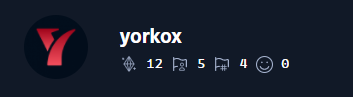

<!--
**yorkox0/yorkox0** is a ✨ _special_ ✨ repository because its `README.md` (this file) appears on your GitHub profile.

Here are some ideas to get you started:

- 🔭 I’m currently working on ...
- 🌱 I’m currently learning ...
- 👯 I’m looking to collaborate on ...
- 🤔 I’m looking for help with ...
- 💬 Ask me about ...
- 📫 How to reach me: ...
- 😄 Pronouns: ...
- ⚡ Fun fact: ...
-->

  <h1> Hello I'm yorkox </h1>

<h3> CyberSecurity Junior | Red-Team/Pentester | HTB Player </h3> 
      <h4>My Hack The Box Profile</h4>
  

 

- Learning CyberSecurity (Pentesting) On HTB(HackTheBox) & THM(TryHackMe)

  
  
  
  
  

